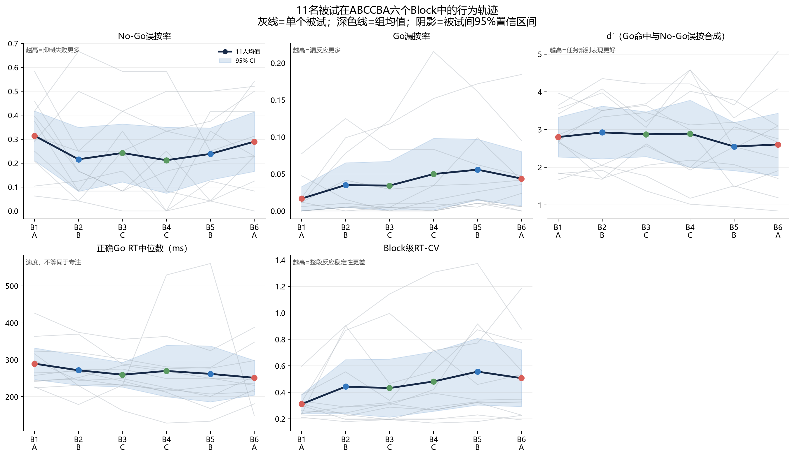
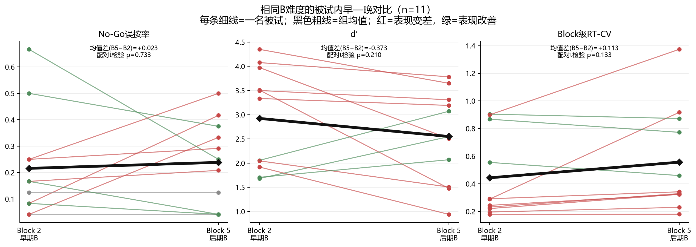
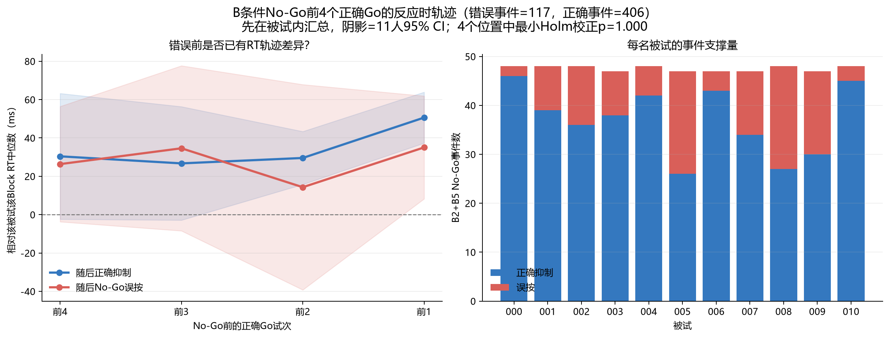
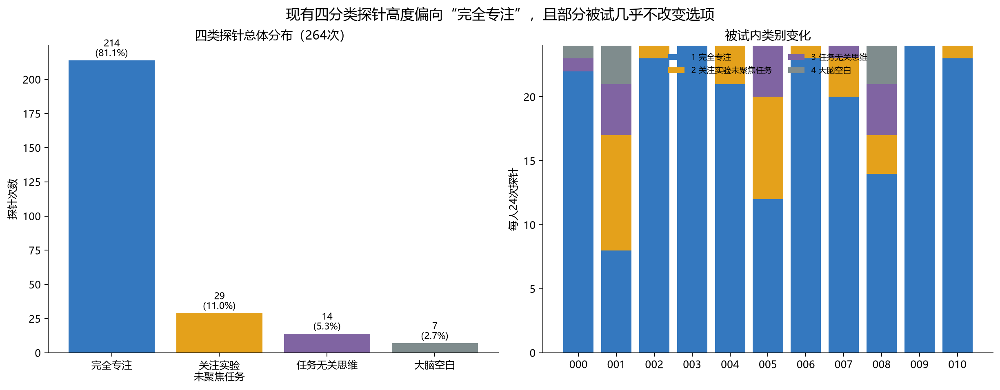
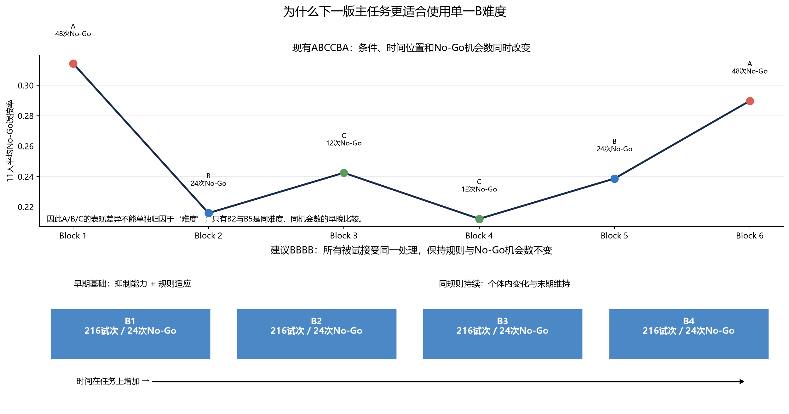

# 014｜正式实验行为任务修改建议报告

> 2026-08-13 17:39（Asia/Shanghai）｜基于11名被试预实验数据、v1行为分析及本轮讨论，建议将正式持续注意主任务由ABCCBA调整为BBBB，并把四分类时间段探针改为二分类即时试次探针；本报告只提出研究设计建议，不修改实验程序。

## 目录

1. [结论先行](#1-结论先行)
2. [我们讨论了什么](#2-我们讨论了什么)
3. [数据与指标口径](#3-数据与指标口径)
4. [11人数据证据](#4-11人数据证据)
5. [方案比较与正式实验建议](#5-方案比较与正式实验建议)
6. [建议的分析框架](#6-建议的分析框架)
7. [仍需验证与最终决策](#7-仍需验证与最终决策)

## 1. 结论先行

当前最合适的主方案是 **BBBB（4个相同B Block）**，而不是继续ABCCBA，也不建议为了“基础抑制能力”额外加入一个A Block。

- B1本身已经能提供个体早期抑制表现；它同时包含规则适应和初始投入，因此应称为“早期行为基线”，不能宣称是纯抑制能力。
- B2—B4在规则、No-Go频率和试次数相同时，变化更容易解释为时间在任务上的持续维持或衰减。
- A若只出现在第一个Block，会与新奇、学习和最高初始投入完全重合；它并不能更干净地分离抑制能力。
- 探针保留，但改成针对刚刚一个试次的二分问题；位置在不同Block中错开，同时所有被试使用完全相同的预生成方案。
- 持续专注不应由单个指标直接定义：Block级用commission、omission和RT-CV描述；错误前预警用短时RT轨迹，不能在四个试次上计算CV；d′只作任务总体表现摘要。

## 2. 我们讨论了什么

讨论从“现有ABCCBA是否能用难度变化制造专注差异”开始。预实验中B2与B5是同条件早晚重复，误按率的描述性差异最明显，因此先考虑保留B作为主难度。随后比较了两个方案：

1. **ABBB**：A作为个体抑制能力参考，后续B观察衰减。问题是A只出现一次且位于开头，A效应无法与初始适应和高投入分开。
2. **BBBB**：B1同时提供早期个体基线，后续相同B直接观察维持。它牺牲了难度对比，却显著减少了正式评分中的设计混杂。

最终讨论倾向BBBB。固定No-Go规律继续保留，以维持SART的规律性和自动化需求；也不做被试间顺序平衡，因为产品最终需要每位被试接受相同处理。探针不删除，但从“四类、回忆一段时间”简化为“二类、判断刚才一个试次”。

## 3. 数据与指标口径

- 数据：sub-000至sub-010，共11人、66个Block、14,256个正式试次、264次探针。
- 当前结构：每Block 216试次；A/B/C分别含48/24/12次No-Go；顺序固定为ABCCBA。
- RT：保留程序归属的反应；0–1200 ms正确Go RT进入本报告描述。`<100`、`<150`、`>1000`和`>1150 ms`只作质量与策略标签，不作为静默剔除规则。
- commission：No-Go误按数 / No-Go机会数。
- omission：Go漏按数 / Go机会数。
- d′：正确Go为Hit，No-Go误按为False Alarm，使用loglinear端点校正。它同时受Go命中和No-Go误按影响，并非“只算Go正确”。
- RT-CV：一个Block内正确Go RT标准差 / 均值，只用于具有足够试次的Block或较长窗口；不用于错误前四个试次。
- 推断单位：B2/B5比较按被试配对；错误前轨迹先在每名被试内汇总，再进行11人的配对比较，避免把重复事件冒充独立样本。

## 4. 11人数据证据

### 4.1 六个Block的整体变化

| Block | 条件 | commission | omission | RT-CV | RT中位数(ms) |  d′ |
| ----: | :--: | ---------: | -------: | ----: | -----------: | ---: |
|     1 |  A  |      0.314 |    0.017 | 0.312 |          290 | 2.80 |
|     2 |  B  |      0.216 |    0.035 | 0.443 |          272 | 2.92 |
|     3 |  C  |      0.242 |    0.034 | 0.433 |          260 | 2.88 |
|     4 |  C  |      0.212 |    0.050 | 0.482 |          270 | 2.89 |
|     5 |  B  |      0.239 |    0.056 | 0.557 |          262 | 2.55 |
|     6 |  A  |      0.290 |    0.044 | 0.507 |          251 | 2.60 |

图中灰线是一名被试，深色线是11人均值，阴影是被试间95%置信区间。它说明行为并不是简单地随Block单调恶化：起始Block也可能因为适应、规则切入或反应策略而不稳定。与此同时，现有顺序让条件与时间位置绑定，不能把A/B/C均值差直接解释成难度造成的专注差异。

RT-CV在这里有价值，因为每个Block约有168–204个Go机会，可以估计整段稳定性；但RT-CV高也可能由极短/极长反应、策略或数据质量造成，必须与RT分布和QC标签一起解释。

### 4.2 同一B难度：Block 2与Block 5

11人中，B5误按率较B2上升者为 **5/11**，下降者为4/11，不变者为2/11。组均值从0.216变为0.239，平均变化+0.023，bootstrap 95% CI [-0.102, +0.140]；配对t检验p=0.733，Wilcoxon p=0.891。

d′平均变化为-0.373（配对t检验p=0.210）；RT-CV平均变化为+0.113（p=0.133）。这些结果可以支持“B2—B5对部分个体有明显早晚变化、B适合做同条件追踪”，但如果95% CI跨0或p≥.05，就不能写成已经证明了统一的群体疲劳效应。

| 被试    | B2误按率 | B5误按率 | B5−B2 |
| ------- | -------: | -------: | -----: |
| sub-000 |    0.042 |    0.042 | +0.000 |
| sub-001 |    0.042 |    0.333 | +0.292 |
| sub-002 |    0.083 |    0.417 | +0.333 |
| sub-003 |    0.167 |    0.208 | +0.042 |
| sub-004 |    0.125 |    0.125 | +0.000 |
| sub-005 |    0.667 |    0.250 | -0.417 |
| sub-006 |    0.167 |    0.042 | -0.125 |
| sub-007 |    0.250 |    0.292 | +0.042 |
| sub-008 |    0.500 |    0.375 | -0.125 |
| sub-009 |    0.250 |    0.500 | +0.250 |
| sub-010 |    0.083 |    0.042 | -0.042 |

真正有产品价值的不是强迫所有人沿同一方向变化，而是同一任务下能否稳定识别“前期好、后期下降”“始终稳定”“前期适应后改善”等个体轨迹。BBBB比ABCCBA更适合验证这种个体内状态变化。

### 4.3 No-Go错误前是否已有预警

本图只使用B2和B5，共117次误按事件、406次正确抑制事件。纵轴不是原始RT，而是相对该被试该Block正确Go RT中位数的偏移；这样减少了被试之间固有快慢差异。每条轨迹先按被试汇总，统计检验的n是11人。

| 位置 | 随后误按−随后正确的RT差 | 未校正p | Holm校正p |
| ---- | -----------------------: | ------: | --------: |
| 前4  |                  -4.1 ms |   0.776 |     1.000 |
| 前3  |                  +7.9 ms |   0.598 |     1.000 |
| 前2  |                 -15.3 ms |   0.588 |     1.000 |
| 前1  |                 -15.6 ms |   0.313 |     1.000 |

如果某个位置为负，表示随后误按前的反应更快，可能对应自动化或预期性反应；为正则表示错误前反而更慢。当前结果用于判断“短时RT轨迹是否值得保留为候选预警特征”，不能把一次加速直接定义为不专注。即使出现显著差异，也仍需在新BBBB数据中做留一被试验证，确认它能预测尚未发生的错误，而不只是事后描述。

这里不计算错误前RT-CV：四个点估计标准差和均值比例极不稳定，且一次极端RT会完全控制结果。更合理的即时特征是相对个人局部基线的RT偏移、最近数次RT斜率、连续极短反应及其与固定周期位置的交互。

### 4.4 现有探针为什么需要简化

四类选择分别为214/29/14/7次，其中“完全专注”占81.1%；有6名被试在24次探针中至少22次选择类别1。类别3和4只有21次，无法支撑稳定的四分类模型。

程序已核实没有默认选择，因此失衡不能解释成默认按钮造成；更可能涉及题目过细、短时间内难以区分心理内容、社会期许，以及样本确实较多处于任务投入状态。把1–4求均值也没有明确心理量尺含义。

当前四个探针固定在trial 30/82/137/191，对应18试次周期的位置12/10/11/11，全部跟在Go试次之后。探针类别因此还与固定周期位置及探针可预测性绑定，下一版应改变位置安排。

### 4.5 为什么A/B/C差异不能直接当作难度证据

现有设计同时改变三件事：时间位置、No-Go密度和条件。A有48次No-Go，B有24次，C只有12次；一个错误在C中就改变8.3个百分点，在B中改变4.2个百分点，在A中改变2.1个百分点。因此条件间原始波动精度并不相同。ABCCBA适合探索“难度/投入变化是否带来生理差异”，却不适合把时间轨迹直接用于统一的专注评分。

## 5. 方案比较与正式实验建议

| 方案   | 优点                                                         | 关键问题                                                    | 结论                 |
| ------ | ------------------------------------------------------------ | ----------------------------------------------------------- | -------------------- |
| ABCCBA | 难度和投入变化大，可能制造较明显生理对比                     | 条件×时间×No-Go机会数混杂；个体评分难统一                 | 不作为持续注意主方案 |
| ABBB   | 有一个高No-Go密度Block，后面可看B衰减                        | A只在开头，不能与适应和初始高投入分离；规则切换又引入新状态 | 不推荐作为主方案     |
| BBBB   | 规则、机会数和试次数一致；可解释被试内时间变化；每人处理相同 | 失去难度对比；B1仍含适应                                    | **推荐**       |

### 5.1 推荐任务结构

- 练习阶段继续存在，但正式主任务使用4个B Block，即 **BBBB**。
- 每Block 216试次、24次No-Go；全程共864试次、96次No-Go。固定18试次规律和B条件No-Go位置保持不变。
- B1标记为“早期基线/适应”，同时保留其前段与后段差异；B2—B4作为相同规则下的持续维持阶段。
- 不把B1误按率称为纯抑制控制能力。它可以作为个体基础表现参考，但仍混合了理解、适应、策略和初始投入。
- 如果未来确实需要独立测量抑制控制，应另设短校准任务并单独验证，而不是在持续注意主线开头塞入一个无法去混杂的A。

### 5.2 推荐探针

建议题干：**“刚才这个试次中，你的注意主要在任务上吗？”**

1. 是，主要在任务上；
2. 否，没有主要在任务上。

使用“试次”而不是“按键”，因为正确No-Go试次本来就不应按键。该题测的是即时主观任务聚焦，不再要求被试区分“关注实验但未聚焦任务、任务无关思维、大脑空白”。

探针建议每Block 4次、共16次。不同Block使用不同位置，但所有被试使用同一份固定调度表，并满足：

- 避开Block开头、结尾和紧邻休息的位置；
- 不再集中在18试次周期的10–12位；
- 在周期位置和前一试次类型上分层，包含Go后与No-Go后，但不根据被试当场正确/错误自适应触发；
- 位置间保持足够间隔，记录调度版本、前一试次类型、周期位置及探针反应时；
- 具体16个位置应在正式程序修改前单独生成并检查，本报告不擅自冻结。

二分探针不是专注“真值”。它只提供稀疏的即时主观标签，用于检查行为和生理特征在“是/否”之间是否有一致的被试内差异。

## 6. 建议的分析框架

应把“基础能力、持续状态、即时风险”分开，避免所有指标混成一个分数：

| 层次         | 时间尺度                | 主要指标                                           | 能回答的问题                       |
| ------------ | ----------------------- | -------------------------------------------------- | ---------------------------------- |
| 早期行为基线 | B1及其稳定阶段          | commission、omission、d′、RT分布、Block级RT-CV    | 这个人在相同任务上的起始表现如何？ |
| 持续维持     | B2—B4及Block内长窗     | commission/omission风险、RT-CV、RT漂移、极短RT比例 | 随时间是否变得更不稳定或更易犯错？ |
| 即时错误预警 | No-Go前数个Go或短时窗口 | 局部RT偏移、斜率、连续快反应、周期位置             | 错误发生前是否出现可预测变化？     |
| 主观状态锚点 | 探针前一个试次          | 二分探针及反应时                                   | 被试当时是否自报主要聚焦任务？     |

d′适合概括一个Block的整体任务辨别表现，但与commission和omission共享信息；未来复合评分不能再把三者当成完全独立证据重复加权。RT均值只表示速度，不能单独映射专注；RT-CV适合较长窗口的稳定性，不能用于少数错误前试次。

## 7. 仍需验证与最终决策

本报告的数据能支持“为什么要从ABCCBA转向同一B难度”和“为什么要简化探针”，但尚不能确定最终专注评分权重。正式采集前后仍需完成：

1. 审批BBBB、4个Block和二分探针题干；另行审查16个具体探针位置。
2. 用新BBBB小样本确认B1适应长度、B2—B4是否产生足够的个体内变化，以及任务总时长是否合适。
3. 对错误前RT候选特征做跨被试预测验证，并控制周期位置；只报告事后差异不等于可预警。
4. 检查二分探针是否仍几乎全选“是”。若仍严重失衡，应重新评估题干或探针价值，而不是强行用作监督标签。
5. 在行为定义稳定后，再检验NIR眼动/瞳孔指标是否能解释同一时间窗中的行为状态。

## 附：复现来源

- 11人逐试次数据：`D:/_AttentionData/output-v2/040-pre-experiment/040-behavior/041-trials.csv`
- 11人Block指标：`D:/_AttentionData/output-v2/040-pre-experiment/040-behavior/042-block_metrics.csv`
- v1既有报告：`D:/_AttentionData/output/040-pre-experiment/010-analysis/behavior/00-整体/00-行为整合分析-预实验.md`
- v1参考实现：`NIR-RGB-extraction/scripts/extract_beh.py`、`plotting/cores/behavior_group_summary.py`、`analyze_behavior_window_feasibility.py`
- 本报告生成脚本：`attention-pipeline-v2/scripts/build_formal_experiment_recommendation.py`
