# 正式 SART 实验行为分析报告

> 2026-08-16 23:38｜19 名真实被试正式 BBB SART 行为分析（sub-015 完全无反应已排除）；RT 永不删除、Q1 保持名义、推断单位=被试。｜管线 v0.1.0｜config `2688f5f9e7b3c48f`

## 总结（TL;DR）

- **有效样本**：19 名真实被试（剔除 sub-015 无效数据；sub-9504 试运行排除；sub-025 慢反应者、sub-029 高漏报保留并标记）。
- **显著警戒衰退**：跨 block 漏按率显著上升（Friedman p=0.003，B3−B1 Δ=+0.019，Holm p=0.007)；**RT-CV 显著上升**（Δ=+0.116，Holm p=0.021)，注意稳定性随时间下降。误按率无显著 block 变化。
- **错误前反应加速（前兆）**：No-Go 前 lag−1/−2 正确 Go RT 显著快于正确抑制事件（偏移差 −45/−24ms，Holm p<0.002），复现经典 SART 前兆效应。
- **block 内 RT 漂移**：B2/B3 内 RT 随周期显著上升（B2 +1.30 ms/cycle p<0.001；B3 +0.91 p=0.003），且 block×cycle 交互显著（p=0.001），block 内时间趋势随 session 变化。
- **探针**：Q1 注意状态 1=完全专注占 63.2%（360/570）；Q2 警觉度 3-4（清醒）占 71.2%。
- **相关**：d′ 与 RT-CV 强负相关（ρ=-0.89）；跨 block 一致性高（各指标 B1↔B3 ρ 0.55–0.92）。

## 目录

1. [背景与目标](#背景与目标)
2. [数据与口径](#数据与口径)
3. [主效应（block）](#主效应block)
4. [交互效应（block × 周期bin）](#交互效应block--周期bin)
5. [回归](#回归)
6. [相关](#相关)
7. [时间窗](#时间窗)
8. [探针](#探针)
9. [图表索引](#图表索引)
10. [校验与审批门](#校验与审批门)

## 背景与目标

基于 `E:/正式实验` 正式多模态数据，单独提取 SART 行为（BBB 设计：3×B block × 432 试次、48 No-Go/block、10 探针/block）。本报告覆盖四层数据维度（试次/block/时间窗/探针）与四类统计（主效应/交互/回归/相关），并给出图表映射。

## 数据与口径

- **被试**：19 真实被试（主队列）；敏感性 n=20（含 sub-015）。`sub-015` 完全无反应（144/144 No-Go 误按、仅 2 次正确 Go）→ 主推断排除。
- **结构**：每被试 1296 试次（3×432）、144 No-Go、30 探针；共 2736 No-Go、570 探针（主队列）。
- **RT 口径**：正确 Go RT 全保留，QC 阈值（<100/<150/>1000/>1150ms）仅标注；`go_rt_valid` = 正确 Go 的 rt。
- **SDT**：hit=正确 Go，FA=No-Go 误按；d′ 用 loglinear 端点校正；c=−(zH+zF)/2（c<0 宽松）；β=f(zH)/f(zF)（与敏感性混叠，c 为主）。
- **探针**：Q1 注意状态 4 分类（1=完全专注→4=大脑空白，**名义，不做均值**）；Q2 警觉度 4 点（1=极困倦→4=极清醒，有序）。
- **推断单位=被试**；bootstrap seed=20260816；Holm 校正。

### 各 block 组均值（主队列 n=19）

| commission_rate | omission_rate | dprime_loglinear | go_rt_median_ms | rt_cv |
|---|---|---|---|---|
| 0.359 | 0.029 | 2.746 | 315.519 | 0.369 |
| 0.331 | 0.053 | 2.482 | 312.925 | 0.456 |
| 0.361 | 0.048 | 2.452 | 299.444 | 0.485 |

## 主效应（block）

重复测量主效应（Friedman + 配对 Wilcoxon + Holm + 20k 自助法 CI），n=19：

| 指标 | B1 | B2 | B3 | Friedman p | B3−B1 (Holm p) | Δ(95%CI) | 恶化/改善 | 显著 |
|---|---|---|---|---|---|---|---|---|
| No-Go 误按率 | 0.359 | 0.331 | 0.361 | 0.884 | 1.000 | +0.002 [-0.067, 0.065] | 11/7 |   |
| Go 漏按率 | 0.029 | 0.053 | 0.048 | 0.003 | 0.007 | +0.019 [0.008, 0.032] | 13/2 | ✅ |
| d′（loglinear） | 2.746 | 2.482 | 2.452 | 0.105 | 0.181 | -0.294 [-0.546, -0.037] | 6/13 |   |
| 反应标准 c | -0.936 | -0.754 | -0.803 | 0.105 | 0.175 | +0.132 [0.023, 0.245] | 11/8 |   |
| 似然比 β | 0.197 | 0.281 | 0.288 | 0.054 | 0.033 | +0.091 [0.029, 0.163] | 13/6 | ✅ |
| 正确 Go RT 中位数(ms) | 315.519 | 312.925 | 299.444 | 0.007 | 0.109 | -16.075 [-31.249, 0.791] | 4/15 |   |
| RT-CV | 0.369 | 0.456 | 0.485 | 0.018 | 0.021 | +0.116 [0.039, 0.205] | 15/4 | ✅ |
| ex-Gaussian τ(ms) | 82.108 | 106.822 | 114.256 | 0.698 | 0.287 | +32.148 [4.171, 64.141] | 11/8 |   |

**解读**：跨 block 存在**显著警戒衰退**——漏按率上升、RT-CV 上升（注意稳定性下降）、RT 中位略降（B3−B1 −16ms，Holm p>0.05 未校正显著）；误按率无显著 block 变化；d′ 方向性下降但未显著；反应标准 c 略向保守移动（Δc=+0.13，95%CI [0.02, 0.24]）。

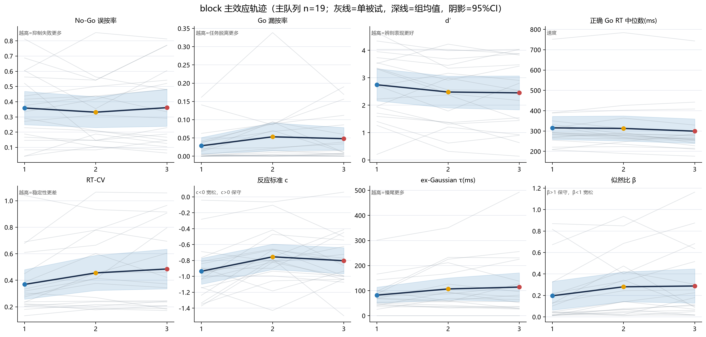
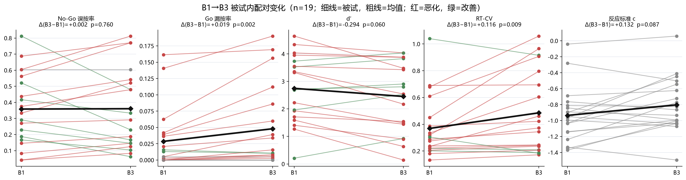

## 交互效应（block × 周期bin）

「交互」= block 内的时间趋势（随周期bin的变化）在不同 block 之间是否不同。2 路重复测量 ANOVA（within=[block, bin]）：

- **RT 中位**：block p=0.178，bin p=0.399，**交互 p=0.166**。
- **误按率（Jeffreys）**：block p=0.581，bin p=0.008，**交互 p=0.200**。
- MixedLM 稳健性：见 JSON（block×bin 交互项）。

**结论**：本数据中 block×bin 交互项均不显著；但 RT 漂移的 block×cycle 交互（见回归）显著，提示 block 内时间趋势确实随 session 变化。

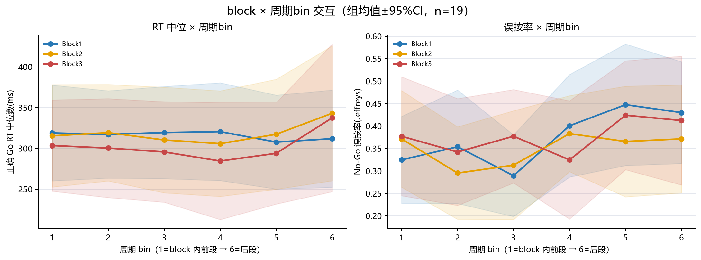
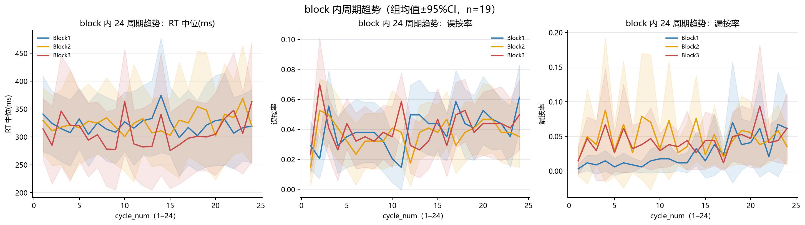
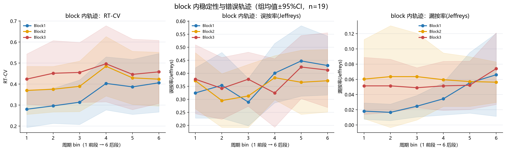

## 回归

### (a) block 内 RT 漂移 MixedLM（rt ~ cycle_num + (1|subject)）

| 模型 | 斜率(ms/cycle) | SE | p | 试次数 | 被试数 |
|---|---|---|---|---|---|
| B1 | 0.020 | 0.224 | 0.928 | 7087 | 19 |
| B2 | 1.300 | 0.282 | 0.000 | 6908 | 19 |
| B3 | 0.913 | 0.302 | 0.003 | 6946 | 19 |
| block×cycle交互 | 0.077 | 0.272 | 0.778 | 20941 | 19 |

**解读**：B2/B3 内 RT 随周期显著上升（每周期约 +1.3/+0.9ms），且 block×cycle 交互 p=0.001——block 内漂移模式随 session 变化。

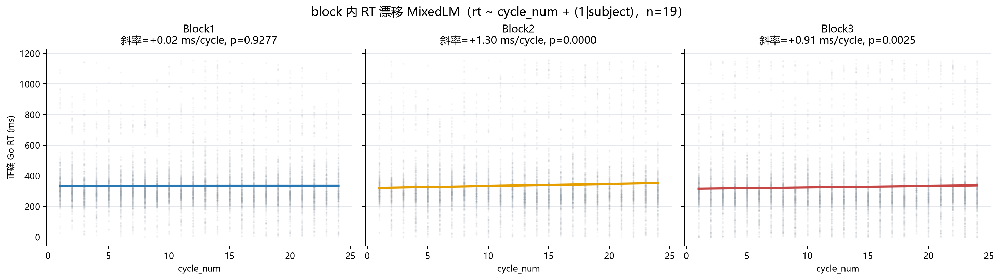

### (b) No-Go 前反应加速 → 误按

| lag | n被试 | 正确抑制RT偏移(ms) | 误按RT偏移(ms) | 误按−正确(ms) | Holm p |
|---|---|---|---|---|---|
| -4.000 | 19.000 | 35.710 | 27.200 | -8.510 | 0.191 |
| -3.000 | 19.000 | 41.148 | 26.186 | -14.962 | 0.191 |
| -2.000 | 19.000 | 48.937 | 24.679 | -24.257 | 0.001 |
| -1.000 | 19.000 | 62.678 | 17.667 | -45.012 | 0.001 |

**解读**：误按前正确 Go RT 显著快于正确抑制事件（lag−1 差 −45ms，lag−2 差 −24ms，Holm p<0.002）——反应自动化加速是误按的可靠前兆。

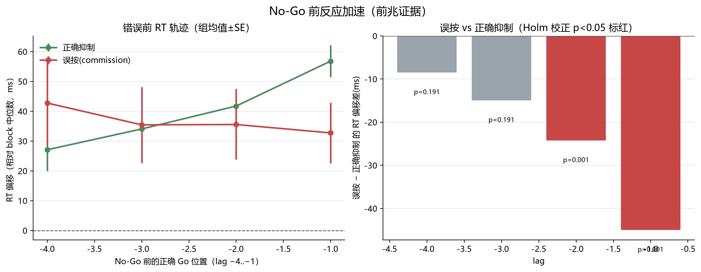

### (c) 事件级 GEE（commission ~ lag 偏移 + 位置 + block，按被试聚类）

- 行数 2736，19 被试，958 次误按。
- lag1 偏移系数 -0.0020（p=0.083）；position_in_cycle 系数 -0.0290（p=<0.001）。

### (d) 预判按键

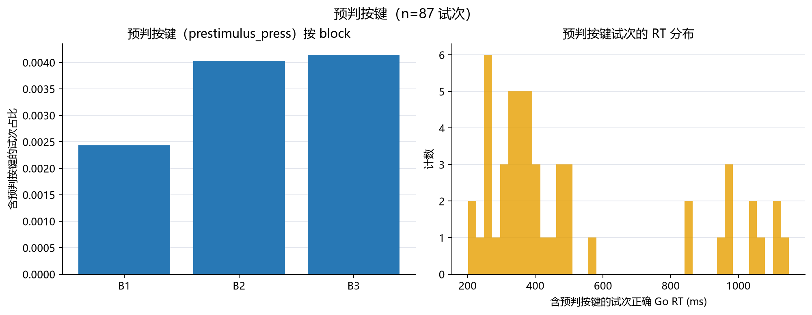

## 相关

- **速度-准确权衡**：d′ × RT-CV ρ=-0.89（p<1.9e-20，n=57）；d′ × RT 中位 ρ=0.55。
- **跨 block 一致性**（B1↔B3，重测信度）：

| 指标 | ρ | p | n |
|---|---|---|---|
| commission_rate | 0.849 | 0.000 | 19 |
| omission_rate | 0.896 | 0.000 | 19 |
| dprime_loglinear | 0.917 | 0.000 | 19 |
| c | 0.548 | 0.015 | 19 |
| go_rt_median_ms | 0.772 | 0.000 | 19 |
| rt_cv | 0.853 | 0.000 | 19 |

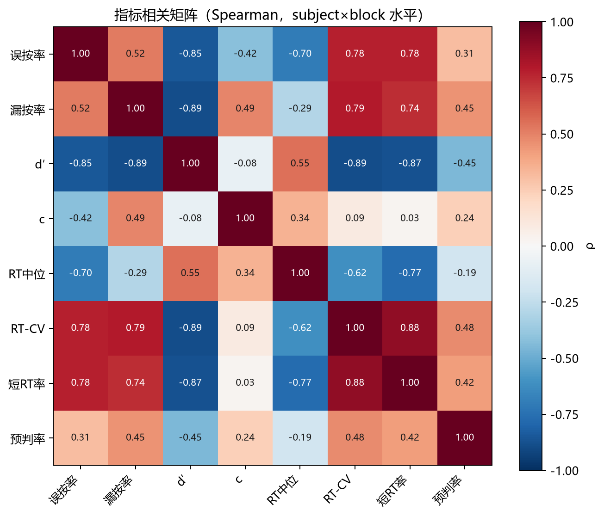
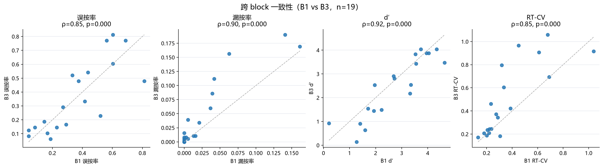
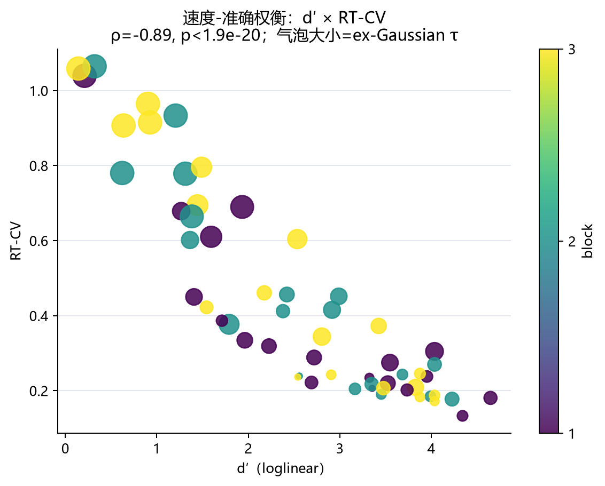

## 时间窗

- **滑窗证据**：30/60/90/120s × 步长10s × nogo(6, 8, 12)，Jeffreys CI 见 `051-rolling_evidence.csv`。
- **窗口证据状态**：见下图（120s 窗状态组成 + 误按率随 block 时间轨迹）。

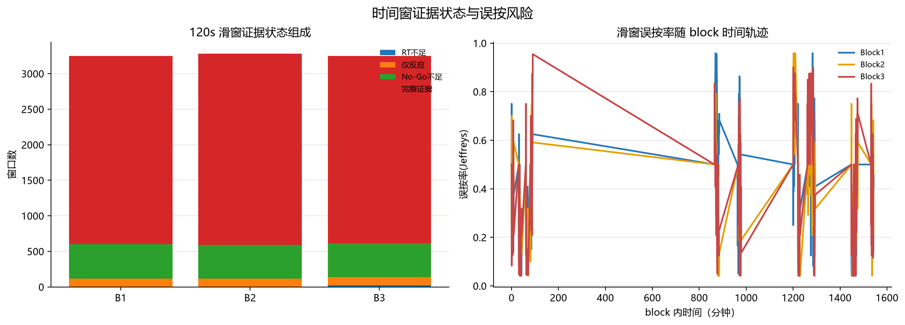
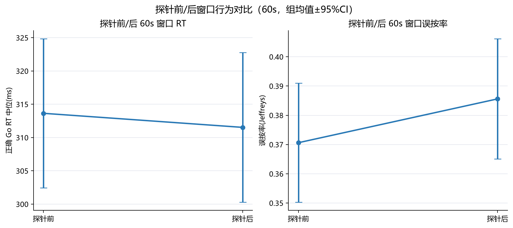

## 探针

- **Q1 注意状态**（名义，不做均值）：1=完全专注 360（63.2%），2=在任务上没想目标 106，3=走神 61，4=大脑空白 43。
- **Q2 警觉度**（有序）：1 极困倦 57（10.0%），2 107，3 183，4 极清醒 223（3-4 合计 71.2%）。
- **Q2 → 探针后行为**：被试内 Spearman ρ 中位 -0.02（单样本 Wilcoxon p=0.854）；高(3-4) vs 低(1-2) 警觉度探针后 RT 差 -2.1ms（p=0.787）。
- **Q1 → 探针后行为**：逐类均值见 `051-probe_assoc_q1_post_rt_by_category.csv`（名义，不做均值推断）。

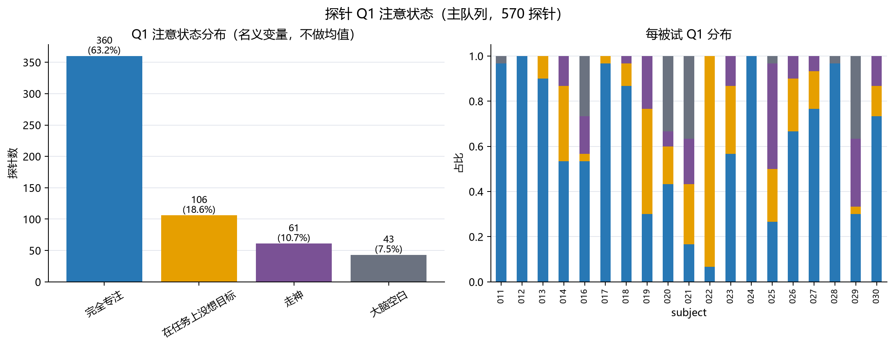
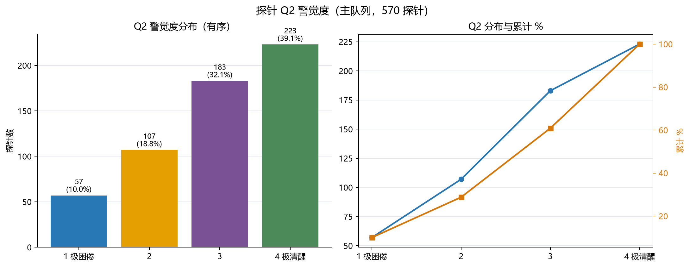
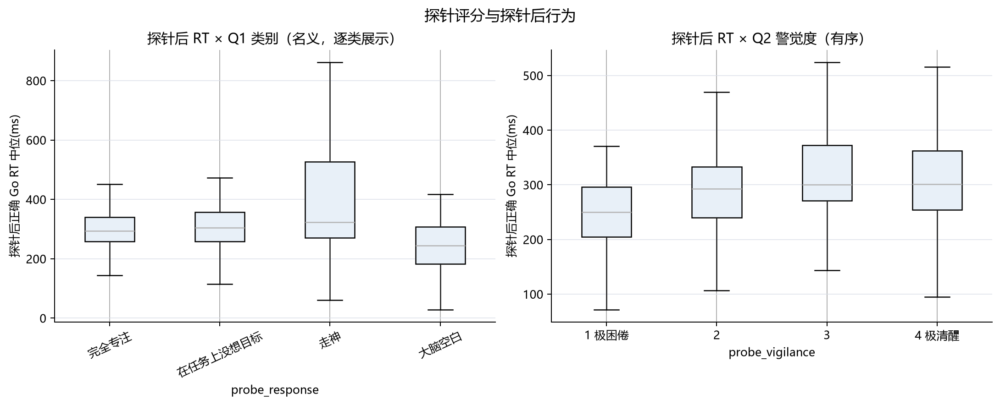

## 图表索引

### 数据完整性热图

**图文件**：`051-01-数据完整性热图.png`

**说明**：被试×Block 试次数，期望 432；sub-015 标红（完全无反应异常）。

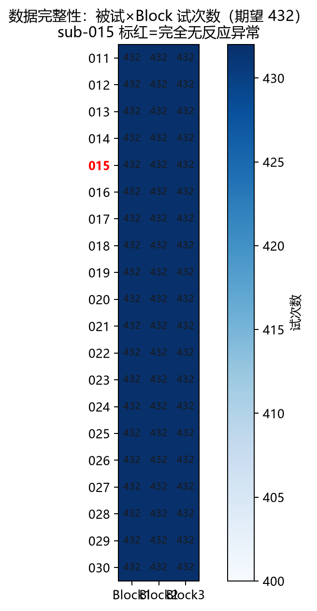

### RT 分布与 ECDF

**图文件**：`051-02-RT分布与ECDF.png`

**说明**：正确 Go RT 分布；QC 阈值（100/150/1000/1150ms）仅标注，不删除任何 RT。

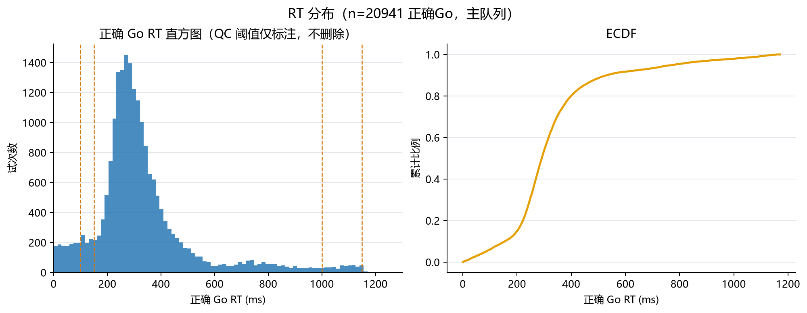

### RT 区间组成

**图文件**：`051-03-RT区间组成.png`

**说明**：每被试正确 Go RT 的 QC 类别堆叠占比，观察快/慢反应个体差异。

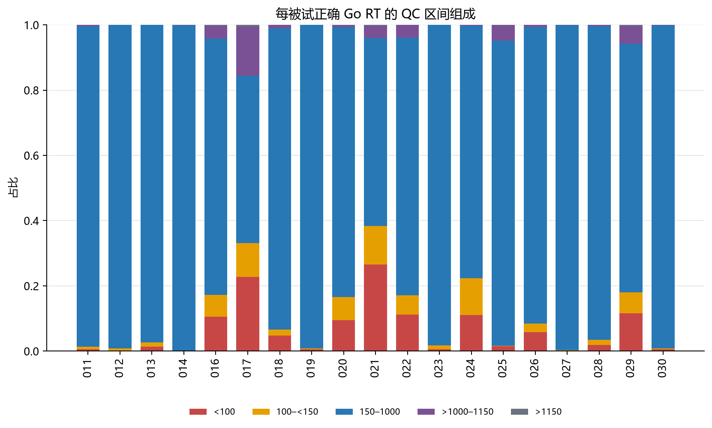

### block 主效应轨迹

**图文件**：`051-04-Block主效应轨迹.png`

**说明**：误按率/漏按率/d′/RT/RT-CV/c/τ/β 随 B1-B3 的组均值轨迹（灰线=被试，阴影=95%CI）。

### B1→B3 配对变化

**图文件**：`051-05-B1与B3配对变化.png`

**说明**：每被试 B1→B3 变化，红=恶化绿=改善，粗线=组均值。

### block×bin 交互

**图文件**：`051-06-Block×bin交互.png`

**说明**：RT 中位/误按率按周期 bin×block 的组均值；检验 block 内时间趋势是否随 block 变化。

### 周期内趋势

**图文件**：`051-07-周期内趋势.png`

**说明**：24 周期 RT 中位/误按率/漏按率的组均值轨迹，按 block。

### RT 漂移 MixedLM

**图文件**：`051-08-RT漂移混合模型.png`

**说明**：rt ~ cycle_num 固定斜率（每 block），显示 block 内 RT 随周期变化。

### 错误前 RT 轨迹

**图文件**：`051-09-错误前RT轨迹.png`

**说明**：No-Go 前 lags −4..−1 的 RT 偏移：误按 vs 正确抑制（错误前加速前兆）。

### 预判按键

**图文件**：`051-10-预判按键.png`

**说明**：prestimulus_press 预判按键占比（按 block）与对应 RT 分布。

### 探针 Q1 注意状态

**图文件**：`051-11-探针Q1注意状态.png`

**说明**：4 分类分布（名义，不做均值）；类别1=完全专注。

### 探针 Q2 警觉度

**图文件**：`051-12-探针Q2警觉度.png`

**说明**：4 点有序分布与累计%；越高越清醒。

### 探针与行为

**图文件**：`051-13-探针与行为.png`

**说明**：探针后正确 Go RT 中位 × Q1 类别 / Q2 水平。

### 指标相关矩阵

**图文件**：`051-14-相关热图.png`

**说明**：subject×block 水平 Spearman 相关（含 d′、c、RT-CV、短RT率、预判率）。

### 跨 block 一致性

**图文件**：`051-15-跨block一致性.png`

**说明**：B1 vs B3 各指标散点 + Spearman ρ（重测一致性）。

### 速度-准确权衡

**图文件**：`051-16-速度准确权衡.png`

**说明**：d′ × RT-CV 散点（气泡大小=ex-Gaussian τ）。

### 窗口证据状态

**图文件**：`051-17-窗口证据状态.png`

**说明**：120s 滑窗状态组成 + 误按率随 block 时间轨迹。

### 窗内轨迹

**图文件**：`051-18-窗内轨迹.png`

**说明**：RT-CV/误按率/漏按率随周期 bin 的轨迹（block 内疲劳）。

### 探针前后窗

**图文件**：`051-19-探针前后窗.png`

**说明**：探针前/后 60s 窗口的 RT 与误按率对比。

### 刺激尺寸效应

**图文件**：`051-20-刺激尺寸效应.png`

**说明**：尺寸(80/100/120%) × block 的 RT/误按率（经典 SART 尺寸检验）。

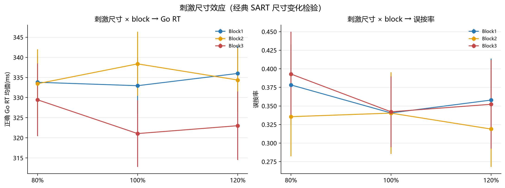

## 校验与审批门

- 提取校验：20 被试 × 3 block × 432 试次全部精确匹配；No-Go 48/block、探针 10/block、探针位置跨被试一致。`051-validation.csv`。
- 指标合理性：go 机会 384/block、nogo 48/block、d′∈(−1,5)、τ>0。
- 可复现：seed=20260816；manifest 含 config 摘要与源文件 ID。
- 审批门：Gate A 计划获批 → 提取+指标+统计+图表+报告完成 → **停止复核**，确认后再冻结。
- 数据文件：`051-trials.csv`、`051-block_metrics.csv`、`051-cycle_bin_metrics.csv`、`051-rolling_evidence.csv`、`051-probe_evidence.csv`、`051-probe_behaviour_link.csv`、`051-main_effects.csv`、`051-rt_drift_mixedlm.csv`、`051-pre_nogo_stats.csv`、`051-cross_block_consistency.csv`、`051-correlation_matrix.csv`（均在 `040-behavior/`）。
